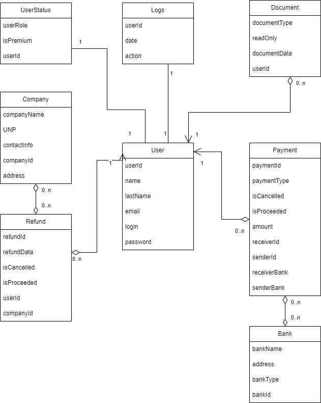

## Requirements:
1. User roles:
   - default
   - admin
---
1. Default user:
   - authentification
   - make payments
   - make refunds
   - order documents
   - edit documents
2. Admin:
   - confirm refunds, orders
   - cancel refunds, orders
   - check log list
---
Database diagram:

---
Database description:

**Highlighted** fields are primary keys or part of them

- User - all users
   - **userId** - uuid
   - userStatusId - uuid(foreign key)
   - name - varchar(20)(user name)
   - lastName - varchar(20)(user last name)
   - password - varchar(20)(user password)
   - email - varchar(30)(user email)

- userStatus - userStatus for users
   - **userId** - uuid
   - userRole - varchar(20)(role name)
   - isPremium - boolean(is user premium)

- Log - user action logs
   - **userId** - uuid(foreign key)
   - date - datetime(date and time of user action)
   - action - varchar(100)(user action for log)

- Document - user's document 
   - **userId** - uuid
   - readonly - boolean(is readonly)
   - documentData - varchar(200)(document info)
   - documentType - varchar(20)(document type)

- Company - all companies
   - **companyId** - uuid
   - UNP - varchar(50)(unp of company)
   - contactInfo - varchar(100)(info to contact company)
   - companyName - varchar(50)(company name)
   - adress - varchar(100)(address of company)

- Refund - user refund
   - **refundId** - uuid
   - refundData - varchar(100)(refund data)
   - isCancelled - boolean(is cancelled)
   - is Proceeded - boolean(is proceeded)
   - userId - uuid(foreign key)
   - companyId - uuid(foreign key)

- Payment - user payments
   - **paymentId** - uuid
   - paymentType - varchar(50)(payment type)
   - isCancelled - boolean(is cancelled)
   - isProceeded - boolean(is proceeded)
   - amount - integer(amount of money)
   - receiverId - uuid
   - senderId - uuid
   - receiverBank - varchar(50)(bank of receiver)
   - senderBank - varchar(50)(bank of senderBank)

- Bank
   - **bankId** - uuid
   - bankName - varchar(50)(name of bank)
   - address - varchar(100)(address of bank)
   - bankType - varchar(30)(type of bank)
---
Normalized Database diagram:

---
